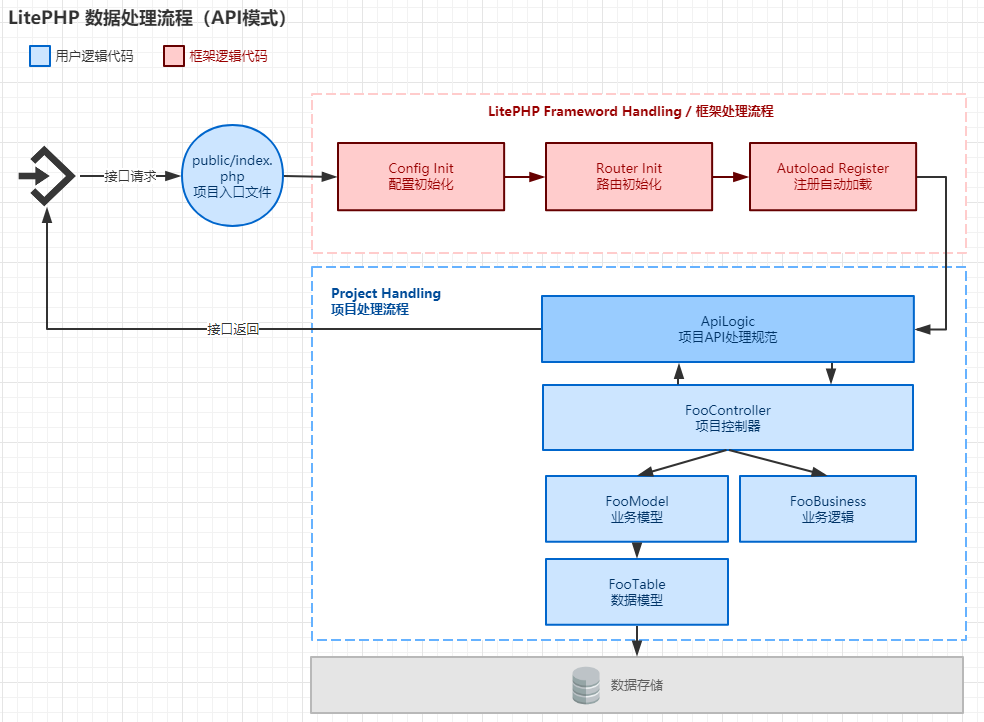

# API 接口模式

LitePHP框架支持构建自定义API接口项目，灵活支持各种CGI规范模式、数据格式等，如 JSON、REST、XML、ProtocolBuff等。用户可通过自行构建API逻辑处理器定义API接口规范，并同时在里面做接口调用鉴权、监控等全局化动作。

## 流程



## ApiLogic示例

> 1. API访问路径格式为: /version/class/action 数据输入方式为: PHP RAW DATA
> 2. 统一返回码格式为: [code:1, message: 'hello',  data: {data}] JSON格式数据。


public/index.php

``` php
<?php
namespace Hello\api;

use Lite\Core\Application;
use Lite\Core\Config;
use Lite\Core\Router;
use Lite\Exception\Exception;
use Lite\Exception\RouterException;

$root = dirname(dirname(__DIR__));
include_once 'Litephp/bootstrap.php';
Application::init(__NAMESPACE__, $root.'/api/', Application::MODE_CLI);

try {
    //定义路径访问规则：/version/api/action 模式
	$path = trim($_SERVER['PATH_INFO'], '/');
	if(!preg_match('/^[\w|\/]+$/', $path)){
		throw new Exception('path illegal:'.$path);
	}

    //寻找文件映射
	list($ver, $class, $act) = explode('/', $path);
	$class = ucfirst($class);
	$file = Config::get('app/path')."$ver/$class.php";
	$class_full = Application::getNamespace()."\\$ver\\$class";
	if(!is_file($file)){
		throw new Exception('api no found:'.$file);
	}

	include $file;

    //映射异常处理
	if(!class_exists($class_full)){
		throw new Exception('class no found:'.$class_full);
	}

    //输入数据(通过RAW DATA方式)
	$raw = Router::readInputData();

    //调用逻辑
	$instance = new $class_full($act, $param);
	if(!method_exists($instance, $act)){
		throw new RouterException('api action no found:'.$act);
	}

	//输出响应
	if($rsp = $instance->$act($raw)){
		exit($rsp);
	}
	throw new Exception('server error');
} catch(\Exception $e){
	//异常处理
	$code = $e->getCode();
	$message = $e->getMessage();
	exit(json_encode(array(
		'code'      => $code,
		'message'   => $message,
		'exception' => $message
	)));
}

```

