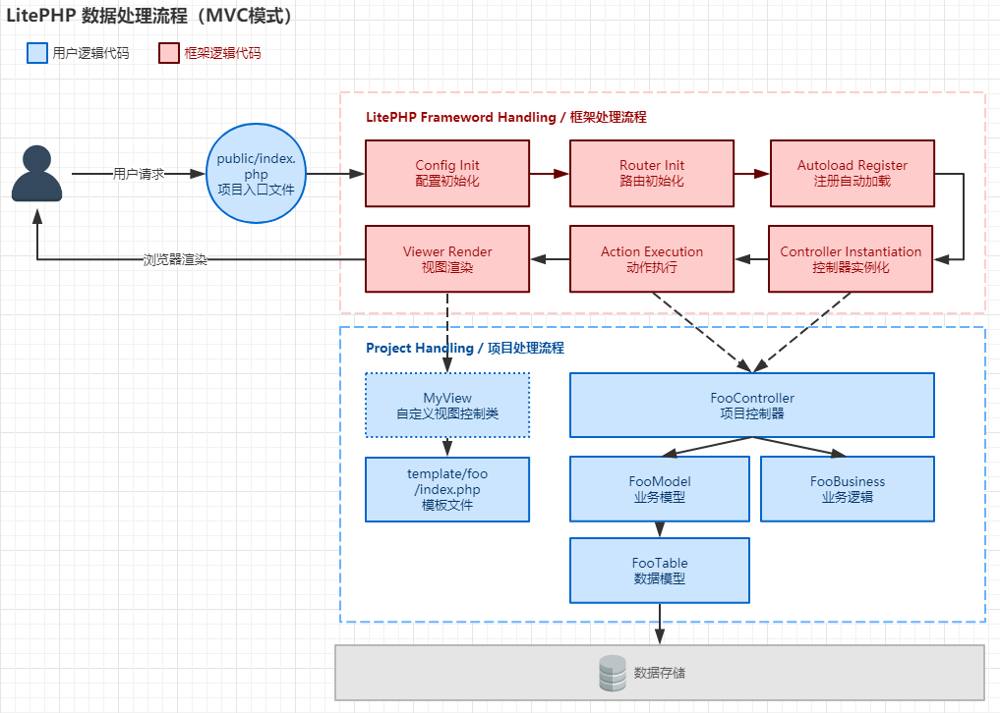

# 开始使用

[TOC]

## 简介
LitePHP为一款轻量化开发模式的PHP开发框架。框架除了提供快捷灵活、简洁高效的开发模式之外，相对于市面上常见的PHP框架，有着以下特殊之处

1. 框架以严格显式调用声明方式定义项目研发模式。
	企业采用该框架开发项目，能够使项目代码具备良好的可读性，项目维护成本低，对于未了解过该框架的技术研发无门槛。通过简单的调用链跟踪即可了解业务逻辑，定位解决业务BUG，以及二次研发自己需要的组件。
2. 代码即文档。
底层代码库以完善、标准的PHPDoc注释标准提供给使用者，研发人员使用框架过程，如使用了IDE工具（如PHPStorm、Eclipse、VisualStudio等），无需阅读框架开发文档，即可一目了然了解框架功能。
3. 代码即数据结构。
市面第一款以显示声明定义数据库表结构模式进行ORM定义的PHP框架。

## 流程


## HelloWorld示例

文件列表：
``` cmd
Litephp
HelloWorld
  ├─app
  │  └─controller
  │　　　IndexController.php
  │
  ├─config
  │　　　app.inc.php
  │
  └─public
　 　　　index.php
```

index.php

``` php
<?php
namespace HelloWorld;

use Lite\Core\Application;
include_once 'Litephp/bootstrap.php';
Application::init(__NAMESPACE__);
```

app.inc.php
``` php
<?php
return array(
	'url' => '/',
);
```

IndexController.php
``` php
<?php
namespace HelloWorld\controller;
use Lite\Core\Controller;
class IndexController extends Controller {
	public function index(){
		echo "Hello World!";
	}
}
```

## 相关文档
更多关于本框架文档信息，请访问 [GitHub](https://github.com/sasumi/litephp) 。

- [安装说明](docs/install.md)
- [配置说明](docs/config.md)
- [数据模型](docs/model.md)
- [项目文件范例](docs/file.md)
- [API接口模式](docs/api.md)
- [MySQL数据库规范](docs/DBDesign.md)
- [PHP 编码检查](docs/inspection.md)
- [PHPDoc 规范](http://docs.phpdoc.org/references/phpdoc/index.html)
- [PSR-2 Coding Style Guide](https://www.php-fig.org/psr/psr-2/)
